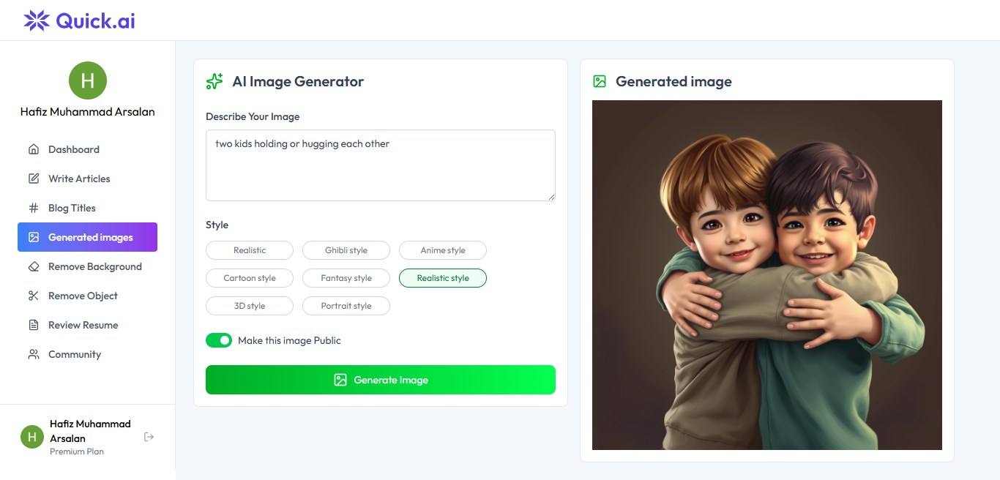
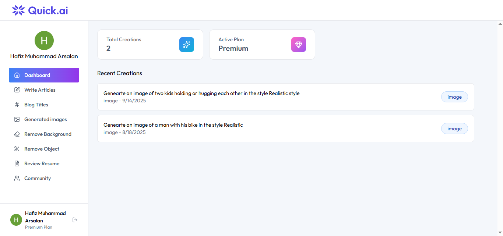

# QuickAI – AI Powered Web Application

## Overview

QuickAI is a web application that generates text responses using modern AI technologies. Designed to help users get instant, intelligent responses based on their input, QuickAI integrates both frontend and backend for a seamless user experience.

## 🚀 My Role

Full Stack Developer (React.js, Node.js, PostgreSQL, OpenAI API)

## Features

- User input form to ask questions or prompts
- Integration with the OpenAI API for AI-powered responses
- User authentication (login/signup)
- Responsive UI with Tailwind CSS, looks good on mobile, tablet, desktop
- Fast data fetching and optimized performance

## Tech Stack

React.js | Node.js | PostgreSQL | Tailwind CSS

## 📦 Live Demo

[Live Demo](https://quick-ai-three-sigma.vercel.app/)

## 📂 GitHub Repo

[GitHub Repository](https://github.com/ArsalanAteeq11/QuickAi-)

## 📸 Screenshots

### Homepage

### AI Response Screen

### Dashboard

## 

> **Why this project matters:**  
> It showcases integration of AI APIs, ability to build back-end + front-end, and delivering polished UI/UX — strong proof of ability to handle real-world apps.
# Quick-AI
